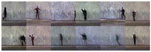

# COT-GAN: Generating Sequential Data via Causal Optimal Transport
This repository contains an implementation and further details of COT-GAN: Generating Sequential Data via Causal Optimal Transport submitted to 34th Conference on Neural Information Processing Systems (NeurIPS 2020).

## Examples of generated videos

### Sprites

### Human actions 

## Steps to use this code:.

- Create a virtual environment to install the necessary libraries and packages

`virtualenv --python=python3.5 gan-env`

`source gan-env/bin/activate`

- Install requirements

`pip3 install -r requirements.txt`

- Open `run_training.sh` and change any parameters at the top of the file.
- Start a training job

`./run_training.sh`

Once training begins, a subfolder `trained/cotgan_%m%d-%H%M` is created which contains logs, checkpoints, and an 'output' file. The 'output' file records training hyperparameters, training losses, and lambda values through training.

## Data
